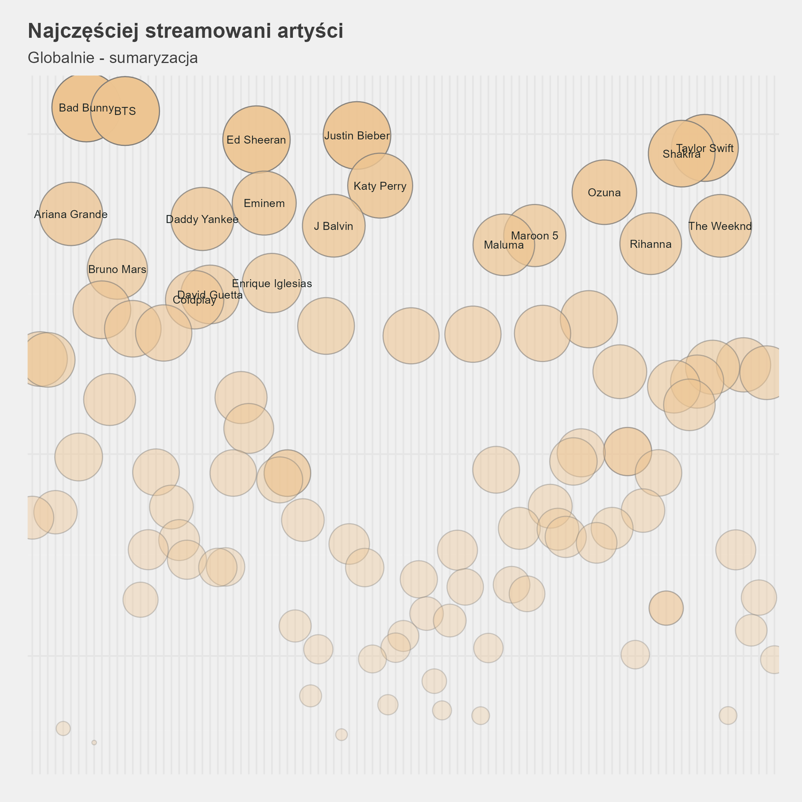
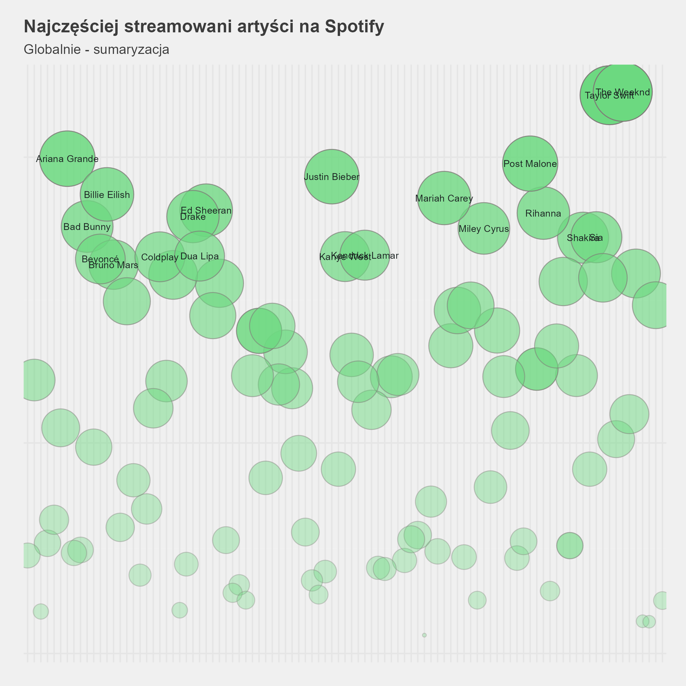
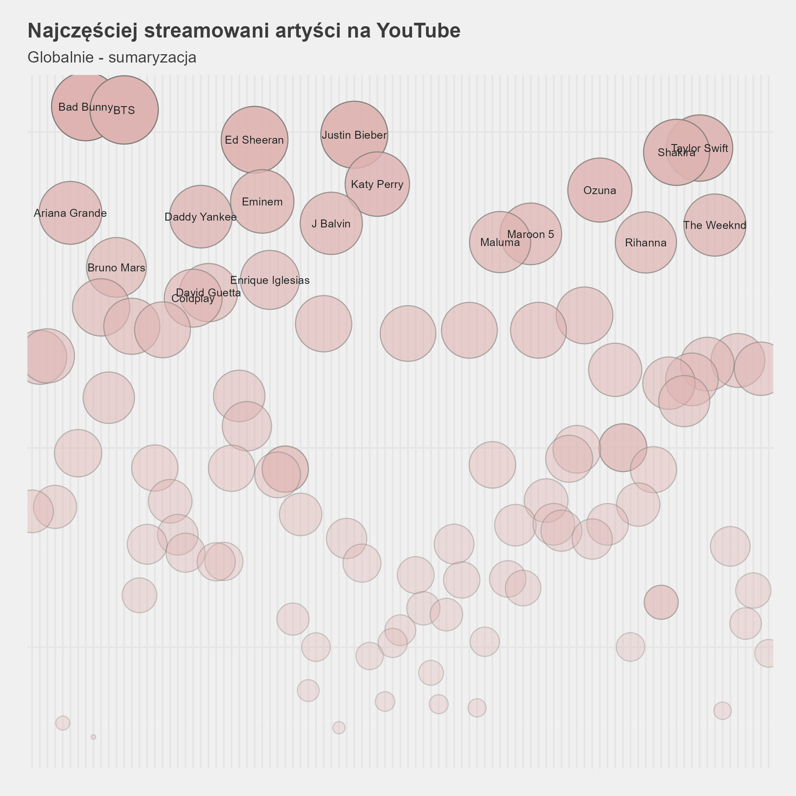
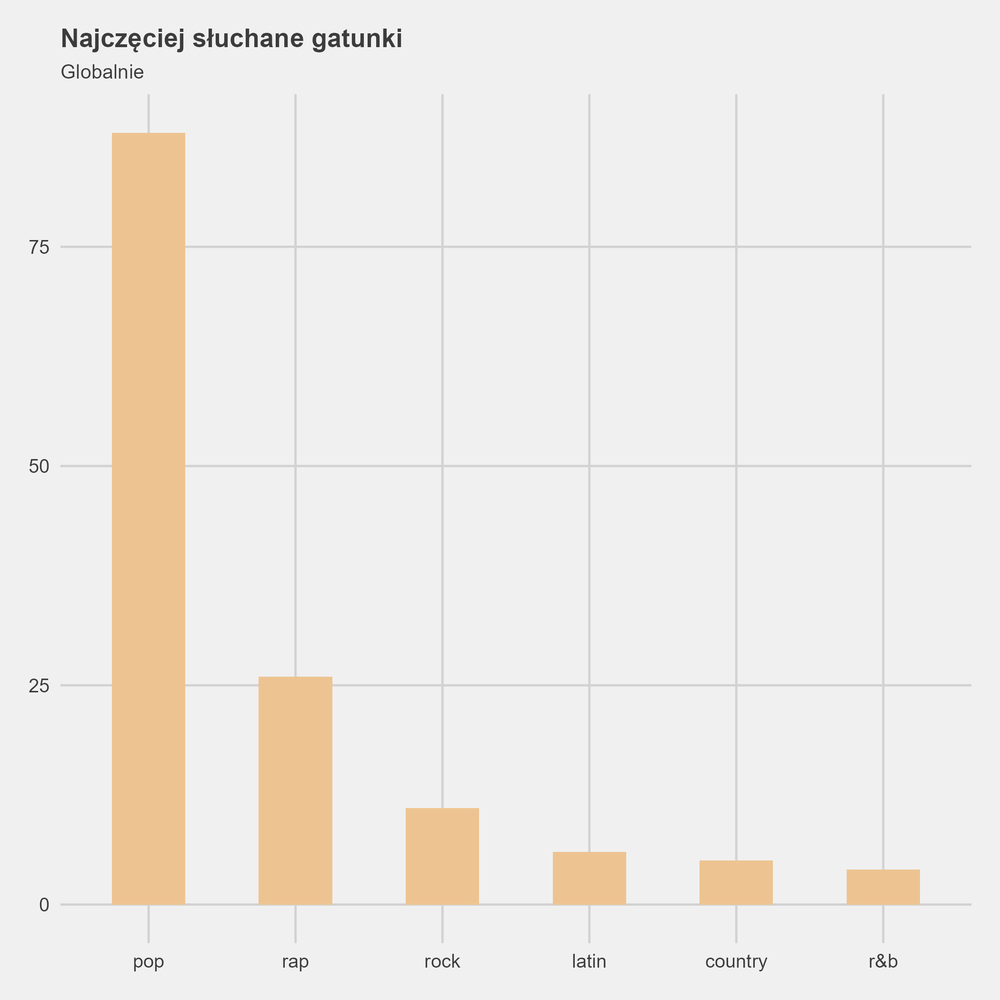
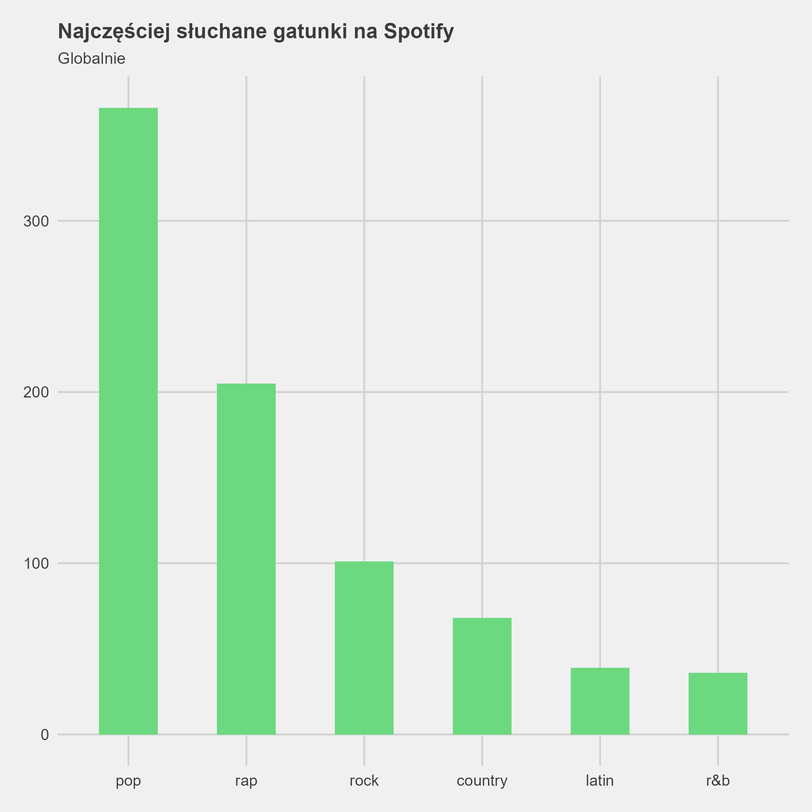
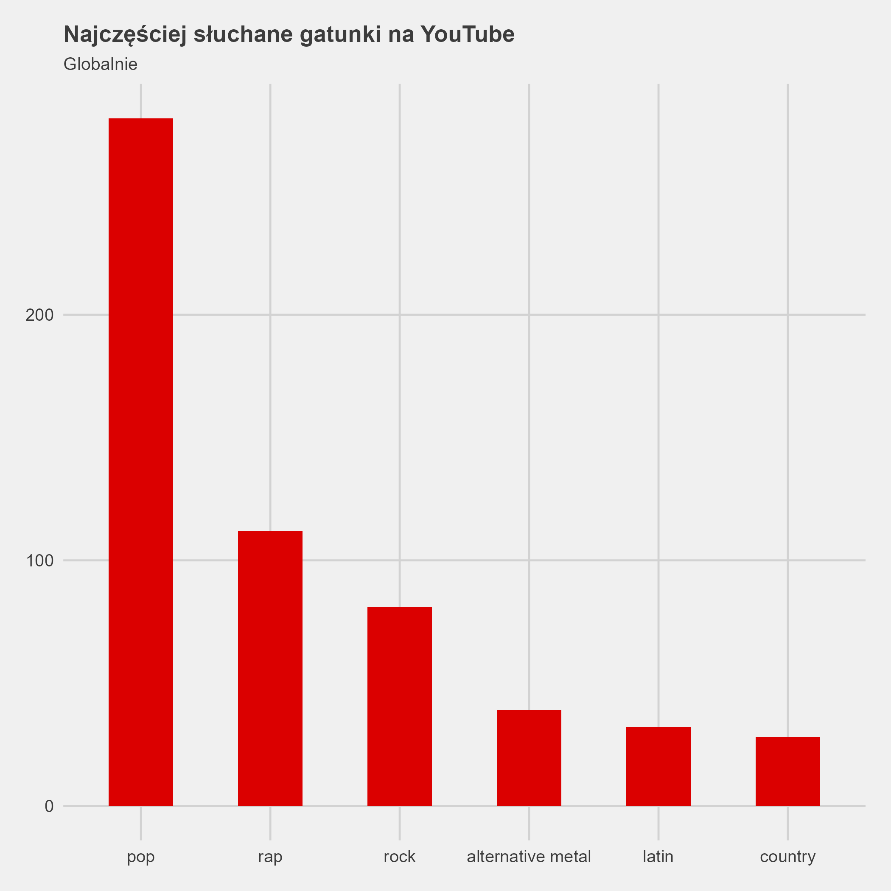

# music_dsp

#### Table of contents
- [Data source](#data-source)
- [Data pipeline](#data-pipeline)
- [Plots](#plots)
- [Instructions](#instructions)

The goal of this analysis is to examine the differences in the listener base of three streaming services: Spotify, Apple Music, and YouTube. This includes differences in the most listened-to genres, artists, and songs. Additionally, for comparison, the iTunes service is also analyzed. Like Apple Music, iTunes is a product of Apple Inc. iTunes serves as a media library, media player, and radio. The reason it is included here is that for many years it was the main benchmark for digital music sales. Now, in the era of streaming, this platform is not as commonly used, so it serves as a contrasting complement to the hard-to-find statistics for Apple Music.

# Data source
I obtained the data from the website [kworb.net](https://kworb.net) and its various subpages. This site is run by an author with the nickname Kworb, who easily provides various statistics on how the music industry is performing on streaming services. Statistics for the most streamed songs on Spotify were taken from [Wikipedia](https://en.wikipedia.org/wiki/List_of_Spotify_streaming_records), as they were not available on [kworb.net](https://kworb.net).

To obtain metadata regarding the genres in which songs and artists perform, I used the [MusicOSet](https://marianaossilva.github.io/DSW2019/) dataset.

# Data pipeline
The pipeline I used for data acquisition and initial technical processing. The lines with the `source()` command were used during my work to connect the entire file structure in the repository to a single main `.Rmd` file. Some are commented out because they are not needed for the export of the report.

The detailed pipeline and analysis process can be found in [the main report file](https://github.com/sand194/music_dsp/blob/main/R_Projekt_Jakub_Piasek_raport.html) (text is in polish).

# Plots
Here are the main plots from the analysis.

## Top streamed artists on all platforms


## Top streamed artists on Spotify


## Top streamed artists on Apple Music


## Top streamed artists on YouTube


## Top streamed artists on iTunes


## Top streamed genres on all platforms


## Top streamed genres on Spotify


## Top streamed genres on Apple Music


## Top streamed genres on YouTube


## Top streamed genres on iTunes


## Top songs differences bar plot


## Top songs differences scatter plot


# Instructions
  Clone the repository:
```bash
  git clone https://github.com/sand194/music_dsp
```

## Navigate to the repository:
```bash
  cd music_dsp
```

## Run the analysis:
Open the main .Rmd file in RStudio and knit it to generate the report.

## Notes
Ensure all necessary packages are installed before running the scripts. The commented lines in the pipeline can be uncommented if additional processing steps are required.
